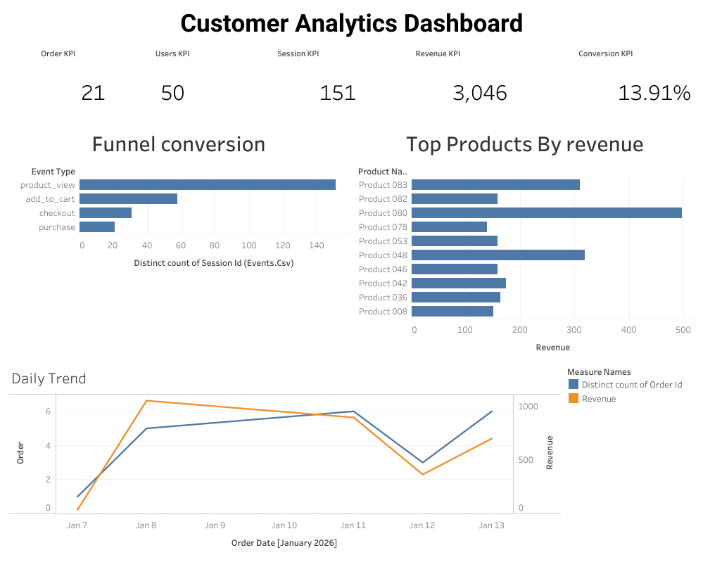

# AWS + Tableau Data Analyst Project 

This project is designed to look **real-world**, by using **tiny data** and **safe cost controls**.

You’ll build a mini **product analytics** dataset (events + orders), store it in **Amazon S3**, and create a **Tableau dashboard**.

## Tableau Public Dashboard

- Live dashboard: https://public.tableau.com/views/CustomerAnalyticsDahsboard/CustomerAnalyticsDashboard?:language=en-US&:sid=&:redirect=auth&:display_count=n&:origin=viz_share_link



## Key insights (from the dashboard)

- Conversion rate is ~13.9% (orders per session).
- 21 orders generated ~$3,046 in revenue.
- Funnel drop-off is largest between **product_view → add_to_cart**.

## What you’ll build (deliverables)

- **Synthetic dataset** (CSV + Parquet):
  - `events` (page_view, product_view, add_to_cart, checkout, purchase)
  - `orders` (order_id, revenue, timestamp, user_id)
- **AWS S3 “data lake”** bucket (free-tier friendly for small usage)
- **Tableau dashboard**:
  - KPI cards (Users, Sessions, Orders, Revenue, Conversion)
  - Funnel (View → Add to Cart → Checkout → Purchase)
  - Daily trend (orders + revenue)
  - Top products
  - Optional: Cohort retention (week 0/1/2)

## Cost note (important)

### Option A (recommended for strict $0): **S3 only**
- Upload the files to S3 (or skip S3 and keep local).
- Use the **local CSV** in Tableau (no paid AWS query services).

### Option B (more “cloud analytics”): **S3 + Athena** (can cost pennies)
- Athena charges **per data scanned**.
- If you keep the dataset tiny (a few MB) and use Parquet, this typically stays very low, but **not guaranteed $0**.

Either way: set billing alerts first.

## Prerequisites (beginner friendly)

- Python 3.10+ installed
- Tableau (Desktop trial or Tableau Public)
- Optional (nice to have): AWS CLI

## Step 0 — Set AWS billing safety (do this first)

1. Create an AWS account (Free Tier).
2. In AWS Console search: **Budgets** → create a budget
   - Budget type: **Cost budget**
   - Amount: **$1** (AWS may not allow $0)
   - Alerts: email at **80%** and **100%**
3. Also enable:
   - **Billing alerts**
   - **MFA** for root user

## Step 1 — Generate the dataset locally (CSV-first)

Open PowerShell in this folder and run:

```bash
python -m venv .venv
.\.venv\Scripts\activate
python -m pip install -r requirements.txt
python .\scripts\generate_data.py
```

Output files will appear in `data/`:
- `data/events.csv`
- `data/orders.csv`
- (Optional) `data/events.parquet`, `data/orders.parquet` (only if Parquet dependencies are available)

## Step 2 — Create an S3 bucket (free-tier friendly)

In AWS Console:
1. Go to **S3** → **Create bucket**
2. Bucket name: `yourname-analytics-<something-unique>`
3. Region: pick the closest to you
4. Keep defaults (block public access ON)

## Step 3 — Upload files to S3

### Console (easiest)
1. Open your bucket → **Create folder**:
   - `events/`
   - `orders/`
2. Upload:
   - `data/events.csv` → `events/`
   - `data/orders.csv` → `orders/`
3. (Optional) If you also have Parquet files, upload them too.

### Optional: Python upload script (after you create AWS credentials)
If you want to upload via code:
1. Create an IAM user with **Programmatic access**
2. Give permission: `AmazonS3FullAccess` (for learning only)
3. Set credentials in your environment:

```bash
$env:AWS_ACCESS_KEY_ID="..."
$env:AWS_SECRET_ACCESS_KEY="..."
$env:AWS_DEFAULT_REGION="us-east-1"
```

Then:

```bash
    python .\scripts\upload_to_s3.py --bucket YOUR_BUCKET_NAME
```

## Step 4 — Build the Tableau dashboard (strict $0 path)

1. Open Tableau
2. Connect → **Text file** → select `data/events.csv`
3. Add another data source: `data/orders.csv`
4. Create relationships / joins:
   - `events.user_id = orders.user_id` (or use `order_id` if you want to enrich purchase events)
5. Create calculated fields:
   - **Conversion rate**: `COUNTD([orders.order_id]) / COUNTD([events.user_id])`
   - **Daily revenue**: `SUM([orders.revenue])`
   - **Funnel step**: use `events.event_type`
6. Build sheets:
   - **KPI cards**: Users, Sessions, Orders, Revenue, Conversion
   - **Funnel**: event_type count for key steps
   - **Daily trend**: date vs orders & revenue
   - **Top products**: product_name by purchases
7. Create a Dashboard and publish (Tableau Public if you want a shareable link).

## Step 5 (Optional) — Athena version (more “cloud”, not guaranteed $0)

If you want to say “I queried data in AWS Athena”, do this:

1. Console → **Athena**
2. Set query result location (required):
   - Create an S3 folder `athena-results/`
   - In Athena settings: set results to `s3://YOUR_BUCKET/athena-results/`
3. Use the SQL in:
   - `sql/athena_ddl_csv.sql` (create external tables on CSV - easiest)
   - `sql/athena_ddl.sql` (Parquet version - optional)
   - `sql/analysis_queries.sql` (funnel + KPIs)
4. Export query results to CSV and connect Tableau to the exported CSV.

## What to put on your resume (copy/paste)

- Built an end-to-end analytics project using **Python + SQL + AWS S3** to generate and curate product event and order datasets (CSV/Parquet).
- Created **Tableau dashboards** for funnel conversion, revenue trends, and top products; delivered an executive summary with actionable insights.
- (Optional) Queried Parquet data using **AWS Athena** and optimized scan cost via columnar storage and small partitions.

## Cleanup (avoid charges)

- Delete the S3 bucket (including all objects)
- Delete Athena result files (`athena-results/`)
- Delete IAM user / access keys (if created)
